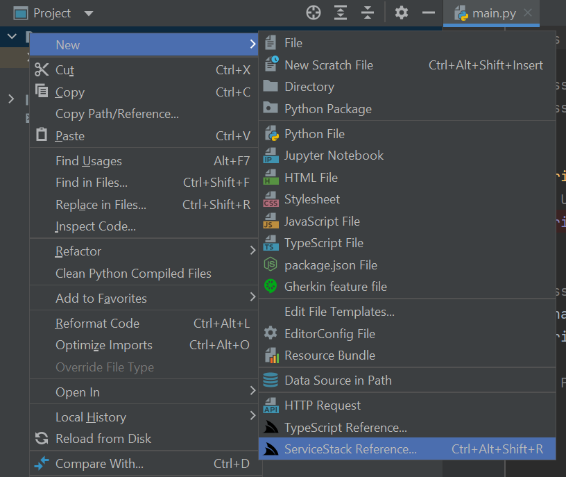
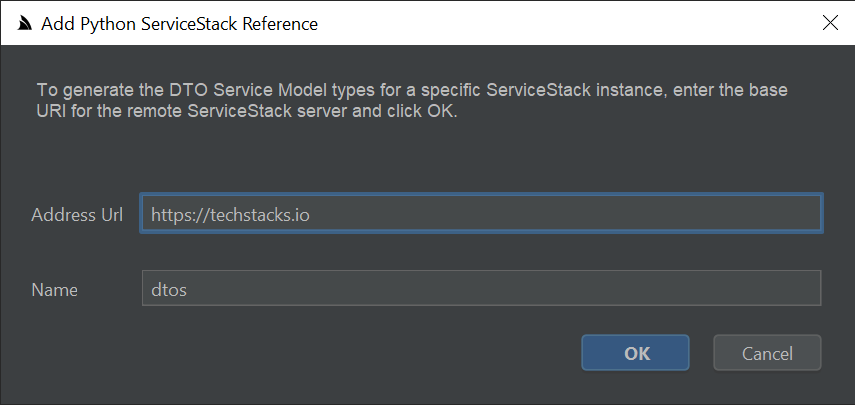

ServiceStack's **Add ServiceStack Reference** feature allows clients to generate Native Types from directly within PyCharm using [ServiceStack IntelliJ Plugin](https://plugins.jetbrains.com/plugin/7749-servicestack/) - providing a simple way to give clients typed access to your ServiceStack Services.

<iframe width="896" height="525" src="https://www.youtube.com/embed/WjbhfH45i5k" frameborder="0" allow="autoplay; encrypted-media" allowfullscreen></iframe>

### First class development experience

[Python](https://python.org) is one of the worlds most popular programming languages thanks to its ease of use and comprehensive libraries which sees it excels in many industries from education where it's often the first language taught in school to data science, machine learning and AI where it's often the dominant language used. To maximize the experience for calling ServiceStack APIs within these environments ServiceStack now supports Python as a 1st class Add ServiceStack Reference supported language which gives Python developers an end-to-end typed API for consuming ServiceStack APIs, complete with IDE integration in [PyCharm](https://www.jetbrains.com/pycharm/) as well as [built-in support in x dotnet tool](/dotnet-tool#addupdate-servicestack-references) to generate Python DTOs for a remote ServiceStack instance from a single command-line.

### Ideal idiomatic Typed Message-based API

To maximize the utility of Python DTOs and enable richer tooling support, Python DTOs are generated as [dataclasses](https://docs.python.org/3/library/dataclasses.html) with support for [JSON serialization](https://pypi.org/project/dataclasses-json/) and annotated with Python 3 [type hints](https://docs.python.org/3/library/typing.html) - that's invaluable when scaling large Python code-bases and greatly improves discoverability of a remote API. DTOs are also enriched with interface markers through Python's multiple inheritance support which enables enables its optimal end-to-end typed API:

The Python DTOs and `JsonServiceClient` library follow Python's [PEP 8's naming conventions](https://www.python.org/dev/peps/pep-0008/) so they'll naturally fit into existing Python code bases. Here's a sample of [techstacks.io](https://techstacks.io) generated Python DTOs containing string and int Enums, an example AutoQuery and a standard Request & Response DTO showcasing the rich typing annotations and naming conventions used:

```python
class TechnologyTier(str, Enum):
    PROGRAMMING_LANGUAGE = 'ProgrammingLanguage'
    CLIENT = 'Client'
    HTTP = 'Http'
    SERVER = 'Server'
    DATA = 'Data'
    SOFTWARE_INFRASTRUCTURE = 'SoftwareInfrastructure'
    OPERATING_SYSTEM = 'OperatingSystem'
    HARDWARE_INFRASTRUCTURE = 'HardwareInfrastructure'
    THIRD_PARTY_SERVICES = 'ThirdPartyServices'

class Frequency(IntEnum):
    DAILY = 1
    WEEKLY = 7
    MONTHLY = 30
    QUARTERLY = 90

# @Route("/technology/search")
@dataclass_json(letter_case=LetterCase.CAMEL, undefined=Undefined.EXCLUDE)
@dataclass
class FindTechnologies(QueryDb2[Technology, TechnologyView], IReturn[QueryResponse[TechnologyView]], IGet):
    ids: Optional[List[int]] = None
    name: Optional[str] = None
    vendor_name: Optional[str] = None
    name_contains: Optional[str] = None
    vendor_name_contains: Optional[str] = None
    description_contains: Optional[str] = None

# @Route("/orgs/{Id}", "PUT")
@dataclass_json(letter_case=LetterCase.CAMEL, undefined=Undefined.EXCLUDE)
@dataclass
class UpdateOrganization(IReturn[UpdateOrganizationResponse], IPut):
    id: int = 0
    slug: Optional[str] = None
    name: Optional[str] = None
    description: Optional[str] = None
    color: Optional[str] = None
    text_color: Optional[str] = None
    link_color: Optional[str] = None
    background_color: Optional[str] = None
    background_url: Optional[str] = None
    logo_url: Optional[str] = None
    hero_url: Optional[str] = None
    lang: Optional[str] = None
    delete_posts_with_report_count: int = 0
    disable_invites: Optional[bool] = None
    default_post_type: Optional[str] = None
    default_subscription_post_types: Optional[List[str]] = None
    post_types: Optional[List[str]] = None
    moderator_post_types: Optional[List[str]] = None
    technology_ids: Optional[List[int]] = None

@dataclass_json(letter_case=LetterCase.CAMEL, undefined=Undefined.EXCLUDE)
@dataclass
class UpdateOrganizationResponse:
    response_status: Optional[ResponseStatus] = None
```

The smart Python `JsonServiceClient` available in the [servicestack](https://pypi.org/project/servicestack/) pip and conda packages enabling the same 
productive, typed API development experience available in our other 1st-class supported client platforms. 

Using [dataclasses](https://docs.python.org/3/library/dataclasses.html) enables DTOs to be populated using a single constructor expression utilizing named parameters which together with the generic `JsonServiceClient` enables end-to-end typed API Requests in a single LOC:

```python
from .dtos import *
from servicestack import JsonServiceClient

client = JsonServiceClient("http://test.servicestack.net")

response: HelloResponse = client.get(Hello(name="World"))
```

> The `HelloResponse` optional type hint doesn't change runtime behavior but enables static analysis tools and IDEs like PyCharm to provide rich intelli-sense and development time feedback.

## Installation

The only requirements for Python apps to perform typed API Requests are the generated Python DTOs and the generic `JsonServiceClient` which can be installed globally or in a virtual Python environment using [Python's pip](https://pypi.org/project/pip/):

    $ pip install servicestack

Or if preferred can be installed with [conda](https://conda.io):

    $ conda install servicestack

### PyCharm ServiceStack Plugin

Python developers of [PyCharm](https://www.jetbrains.com/pycharm/) Professional and [FREE Community Edition](https://www.jetbrains.com/pycharm/features/#chooseYourEdition) can get a simplified development experience for consuming ServiceStack Services by installing the [ServiceStack Plugin](https://plugins.jetbrains.com/plugin/7749-servicestack) from the JetBrains Marketplace:

[](https://plugins.jetbrains.com/plugin/7749-servicestack)

Where you'll be able to right-click on a directory and click on **ServiceStack Reference** on the context menu:



To launch the **Add Python ServiceStack Reference** dialog where you can enter the remote URL of the ServiceStack endpoint you wish to call to generate the Typed Python DTOs for all APIs which by default will saved to `dtos.py`:



Then just import the DTOs and `JsonServiceClient` to be able to consume any of the remote ServiceStack APIs:

```python
from .dtos import *
from servicestack import JsonServiceClient

client = JsonServiceClient("https://techstacks.io")

response = client.send(FindTechnologies(
    ids=[1, 2, 4, 6],
    vendor_name="Google",
    take=10))
```

If any of the the remote APIs change their DTOs can be updated by right-clicking on `dtos.py` and clicking **Update ServiceStack Reference**:


### Simple command-line utility for Python

Developers using other Python IDEs and Text Editors like VS Code can utilize the cross-platform [`x` command line utility](/dotnet-tool) for generating Python DTOs from the command-line.

To install first install the [latest .NET SDK](https://dotnet.microsoft.com/download) for your OS then install the [`x` dotnet tool](/dotnet-tool) with:

    $ dotnet tool install --global x 

### Adding a ServiceStack Reference

To Add a Python ServiceStack Reference just call `x python` with the URL of a remote ServiceStack instance:

    $ x python https://techstacks.io

Result:

    Saved to: dtos.py

Calling `x python` with just a URL will save the DTOs using the Host name, you can override this by specifying a FileName as the 2nd argument:

    $ x python https://techstacks.io Tech

Result:

    Saved to: Tech.dtos.py

### Updating a ServiceStack Reference

To Update an existing ServiceStack Reference, call `x python` with the Filename:

    $ x python dtos.py

Result:

    Updated: dtos.py

Which will update the File with the latest Python Server DTOs from [techstacks.io](https://techstacks.io). You can also customize how DTOs are generated by uncommenting the [Python DTO Customization Options](/#dto-customization-options) and updating them again.

### Updating all Python DTOs

Calling `x python` without any arguments will update all Python DTOs in the current directory:

    $ x python

Result:

    Updated: Tech.dtos.py
    Updated: dtos.py

### Smart Generic JsonServiceClient

The generic `JsonServiceClient` is a 1st class client with the same rich featureset of the smart ServiceClients in other [1st class supported languages](/add-servicestack-reference#supported-languages) sporting a terse, typed flexible API with support for additional untyped params, custom URLs and HTTP Methods, dynamic response types including consuming API responses in raw text and binary data formats. Clients can be decorated to support generic functionality using instance and static Request, Response and Exception Filters.

It includes built-in support for a number of [ServiceStack Auth options](/authentication-and-authorization) including [HTTP Basic Auth](https://en.wikipedia.org/wiki/Basic_access_authentication) and stateless Bearer Token Auth Providers like [API Key](/api-key-authprovider) and [JWT Auth](/jwt-authprovider) as well as [stateful Sessions](/sessions) used by the popular **credentials** Auth Provider and an `on_authentication_required` callback for enabling custom authentication methods. The built-in auth options include auto-retry support for transparently authenticating and retrying authentication required requests as well as [Refresh Token Cookie](/jwt-authprovider#refresh-token-cookies-supported-in-all-service-clients) support where it will transparently fetch new JWT Bearer Tokens automatically behind-the-scenes for friction-less stateless JWT support.

A snapshot of these above features is captured in the high-level public API below:

```python
class JsonServiceClient:
    base_url: str
    reply_base_url: str
    oneway_base_url: str
    headers: Optional[Dict[str, str]]
    bearer_token: Optional[str]
    refresh_token: Optional[str]
    refresh_token_uri: Optional[str]
    username: Optional[str]
    password: Optional[str]

    on_authentication_required: Callable[[], None]

    global_request_filter: Callable[[SendContext], None]  # static
    request_filter: Callable[[SendContext], None]

    global_response_filter: Callable[[Response], None]  # static
    response_filter: Callable[[Response], None]

    exception_filter: Callable[[Response, Exception], None]
    global_exception_filter: Callable[[Response, Exception], None]

    def __init__(self, base_url)

    def set_credentials(self, username, password)
    @property def token_cookie(self)
    @property def refresh_token_cookie(self)

    def get(self, request: IReturn[T], args: Dict[str, Any] = None) -> T
    def post(self, request: IReturn[T], body: Any = None, args: Dict[str, Any] = None) -> T
    def put(self, request: IReturn[T], body: Any = None, args: Dict[str, Any] = None) -> T
    def patch(self, request: IReturn[T], body: Any = None, args: Dict[str, Any] = None) -> T
    def delete(self, request: IReturn[T], args: Dict[str, Any] = None) -> T
    def options(self, request: IReturn[T], args: Dict[str, Any] = None) -> T
    def head(self, request: IReturn[T], args: Dict[str, Any] = None) -> T
    def send(self, request, method: Any = None, body: Any = None, args: Dict[str, Any] = None)

    def get_url(self, path: str, response_as: Type, args: Dict[str, Any] = None)
    def delete_url(self, path: str, response_as: Type, args: Dict[str, Any] = None)
    def options_url(self, path: str, response_as: Type, args: Dict[str, Any] = None)
    def head_url(self, path: str, response_as: Type, args: Dict[str, Any] = None)
    def post_url(self, path: str, body: Any = None, response_as: Type = None, args: Dict[str, Any] = None)
    def put_url(self, path: str, body: Any = None, response_as: Type = None, args: Dict[str, Any] = None)
    def patch_url(self, path: str, body: Any = None, response_as: Type = None, args: Dict[str, Any] = None)
    def send_url(self, path: str, method: str = None, response_as: Type = None, body: Any = None,
                 args: Dict[str, Any] = None)

    def send_all(self, request_dtos: List[IReturn[T]])  # Auto Batch Reply Requests
    def send_all_oneway(self, request_dtos: list)       # Auto Batch Oneway Requests
```

### Change Default Server Configuration

The above defaults are also overridable on the ServiceStack Server by modifying the default config on the `NativeTypesFeature` Plugin, e.g:

```csharp
var nativeTypes = this.GetPlugin<NativeTypesFeature>();
nativeTypes.MetadataTypesConfig.AddResponseStatus = true;
...
```

Python specific functionality can be added by `PythonGenerator`

```python
PythonGenerator.DefaultImports.Add("requests");
```

### Customize DTO Type generation

Additional Python specific customization can be statically configured like `PreTypeFilter`, `InnerTypeFilter` & `PostTypeFilter` (available in all languages) can be used to inject custom code in the generated DTOs output. 

Use the `PreTypeFilter` to generate source code before and after a Type definition, e.g. this will append the `Decorator` class decorator on non enum & interface types:

```csharp
PythonGenerator.PreTypeFilter = (sb, type) => {
    if (!type.IsEnum.GetValueOrDefault() && !type.IsInterface.GetValueOrDefault())
    {
        sb.AppendLine("@Decorator");
    }
};
```

The `InnerTypeFilter` gets invoked just after the Type Definition which can be used to generate common members for all Types and interfaces, e.g:

```csharp
PythonGenerator.InnerTypeFilter = (sb, type) => {
    sb.AppendLine("id:str = str(random.random())[2:]");
};
```

There's also `PrePropertyFilter` & `PostPropertyFilter` for generating source before and after properties, e.g:

```csharp
PythonGenerator.PrePropertyFilter = (sb , prop, type) => {
    if (prop.Name == "Id")
    {
        sb.AppendLine("@IsInt");
    }
};
```

### Emit custom code

To enable greater flexibility when generating complex Typed DTOs, you can use `[Emit{Language}]` attributes to generate code before each type or property.

These attributes can be used to generate different attributes or annotations to enable client validation for different validation libraries in different languages, e.g:

```csharp
[EmitCode(Lang.Python, "# App User")]
[EmitPython("@Validate")]
public class User : IReturn<User>
{
    [EmitPython("@IsNotEmpty", "@IsEmail")]
    [EmitCode(Lang.Swift | Lang.Dart, new[]{ "@isNotEmpty()", "@isEmail()" })]
    public string Email { get; set; }
}
```

Which will generate `[EmitPython]` code in Python DTOs:

```python
# App User
@Validate
@dataclass_json(letter_case=LetterCase.CAMEL, undefined=Undefined.EXCLUDE)
@dataclass
class User:
    @IsNotEmpty
    @IsEmail
    email: Optional[str] = None
```

Whilst the generic `[EmitCode]` attribute lets you emit the same code in multiple languages with the same syntax.

### Python Reference Example

Lets walk through a simple example to see how we can use ServiceStack's Python DTO annotations in our Python JsonServiceClient. Firstly we'll need to add a Python Reference to the remote ServiceStack Service by **right-clicking** on a project folder and clicking on `ServiceStack Reference...` (as seen in the above screenshot).

This will import the remote Services dtos into your local project which looks similar to:

```python
""" Options:
Date: 2021-08-14 15:33:39
Version: 5.111
Tip: To override a DTO option, remove "//" prefix before updating
BaseUrl: https://techstacks.io

#GlobalNamespace: 
#MakePropertiesOptional: False
#AddServiceStackTypes: True
#AddResponseStatus: False
#AddImplicitVersion: 
#AddDescriptionAsComments: True
#IncludeTypes: 
#ExcludeTypes: 
#DefaultImports: datetime,decimal,marshmallow.fields:*,servicestack:*,typing:*,dataclasses:dataclass/field,dataclasses_json:dataclass_json/LetterCase/Undefined/config,enum:Enum/IntEnum
#DataClass: 
#DataClassJson: 
"""

@dataclass_json(letter_case=LetterCase.CAMEL, undefined=Undefined.EXCLUDE)
@dataclass
class GetTechnologyResponse:
    created: datetime.datetime = datetime.datetime(1, 1, 1)
    technology: Optional[Technology] = None
    technology_stacks: Optional[List[TechnologyStack]] = None
    response_status: Optional[ResponseStatus] = None

# @Route("/technology/{Slug}")
@dataclass_json(letter_case=LetterCase.CAMEL, undefined=Undefined.EXCLUDE)
@dataclass
class GetTechnology(IReturn[GetTechnologyResponse], IRegisterStats, IGet):
    slug: Optional[str] = None
```

In keeping with idiomatic style of local `.py` sources, generated types are not wrapped within a module by default. This lets you reference the types you want directly using normal import destructuring syntax:

```python
from .dtos import GetTechnology, GetTechnologyResponse
```

Or import all Types into your preferred variable namespace with:

```python
from .dtos import *

request = GetTechnology()
```

### Making Typed API Requests
