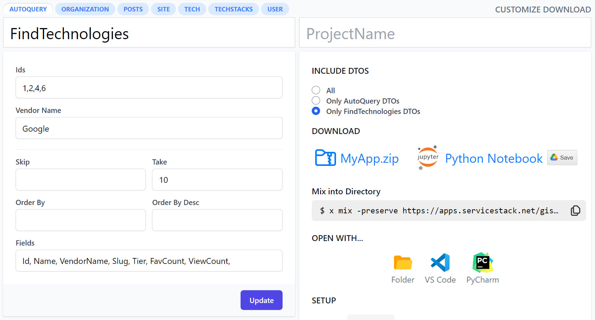
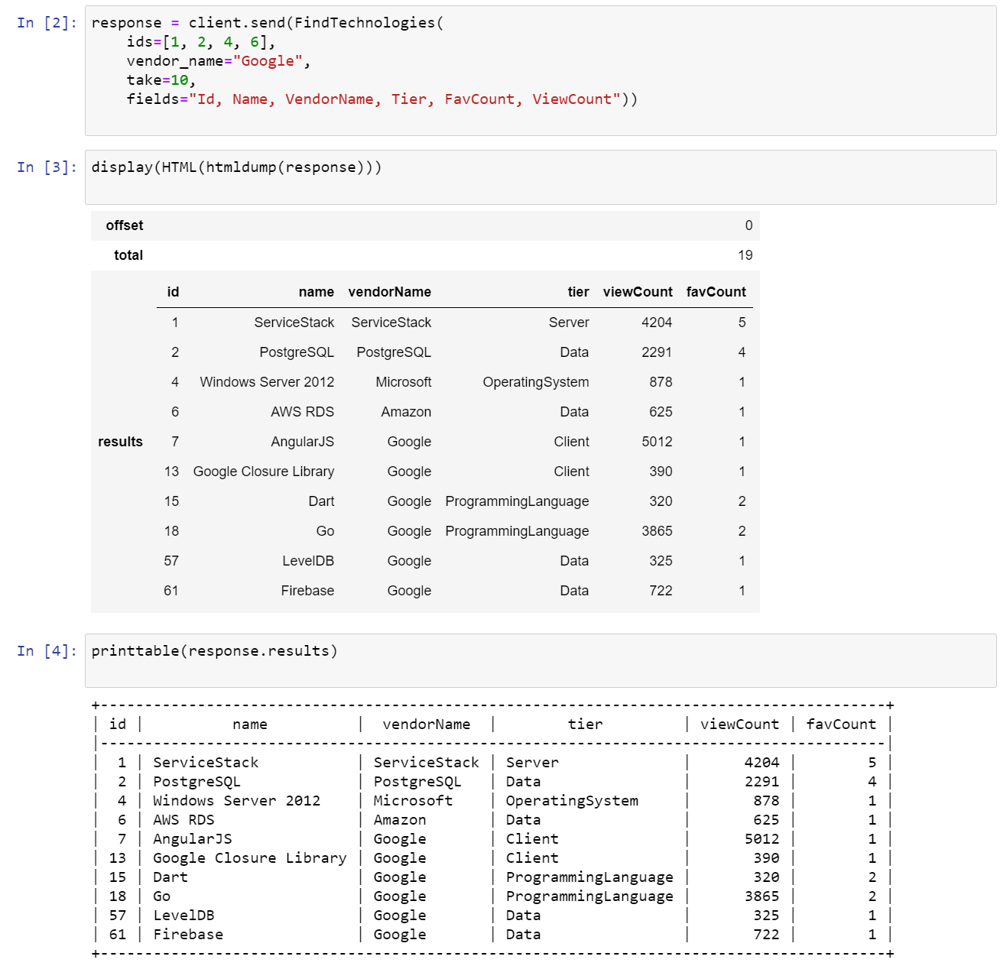
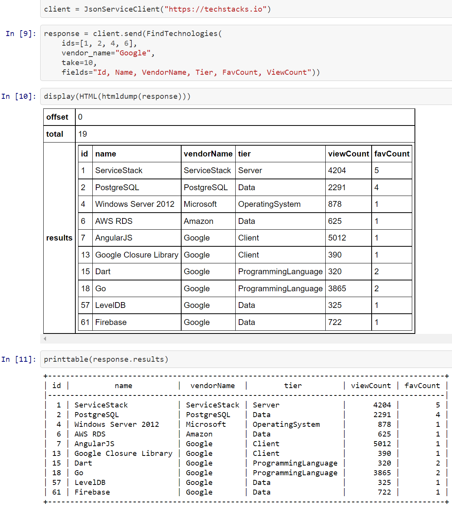

Whilst the [Jupyter project](https://jupyter.org) has designed its Notebooks to be language agnostic with current support for over 40+ programming languages, the best experience and broadest ecosystem and community support is still centered around Python Jupyter Notebooks.

Thanks to [Python Add ServiceStack Reference](/python-add-servicestack-reference) support for generating typed Python data classes for your ServiceStack Service DTOs, your API consumers are able to tap into the beautiful [interactive world of Jupyter Notebooks](/jupyter-notebooks) who can leverage end-to-end typed APIs with your Services Python DTOs and the generic [servicestack](https://pypi.org/project/servicestack/) Python package containing both the generic `JsonServiceClient` for making typed API requests as well as useful utilities for easily previewing API Responses in human-readable HTML or markdown table formats.

<iframe width="896" height="525" src="https://www.youtube.com/embed/h6UwDuXt8MA" frameborder="0" allow="autoplay; encrypted-media" allowfullscreen></iframe>

## Instant Client Apps

Easiest way to generate a Python Notebook for a publicly available ServiceStack instance is to use Instant Client Apps UI at:

### [apps.servicestack.net](https://apps.servicestack.net)

Where API Consumers will be able to select an API for a remote ServiceStack Instance and generate a native UI to generate an API Request that can be downloaded in a stand-alone client App in any of the 9 supported programming languages:

[](https://apps.servicestack.net)

Within seconds after being guided by Instant Client Apps UI, users will be able to select their preferred API and use the Auto form to pre-populate their API 
Request, e.g:

[](https://apps.servicestack.net/#techstacks.io/python/AutoQuery/FindTechnologies(Ids:[1,2,4,6],VendorName:Google,Take:10,Fields:%22Id,%20Name,%20VendorName,%20Slug,%20Tier,%20FavCount,%20ViewCount%22))

Which can be run online to display results in a HTML table and a human-friendly markdown table for [AutoQuery Requests](/autoquery-rdbms) or API Responses containing a `Results` resultset. Clicking on **Python Notebook** will download a custom [techstacks.io-FindTechnologies.ipynb](https://github.com/ServiceStack/jupyter-notebooks/blob/main/techstacks.io-FindTechnologies.ipynb) Jupyter Notebook that when executed in either a Binder or self-hosted **notebook** web app will render API responses that looks like:

[](https://github.com/ServiceStack/jupyter-notebooks/blob/main/techstacks.io-FindTechnologies.ipynb)

All populated API Requests are also deep-linkable so they can be easily documented, shared and customized with other team members:

**[apps.servicestack.net/#techstacks.io/python/AutoQuery/FindTechnologies(Ids:[1,2,4,6],VendorName:Google,Take:10)](https://apps.servicestack.net/#techstacks.io/python/AutoQuery/FindTechnologies(Ids:[1,2,4,6],VendorName:Google,Take:10,Fields:%22Id,%20Name,%20VendorName,%20Slug,%20Tier,%20FavCount,%20ViewCount%22))**

### Google Colab

[Google Colab](https://research.google.com/colaboratory/) is a **FREE** hosted Jupyter notebook service from Google that can open Notebooks stored in Google Drive that can be shared just as you would with Google Docs or Sheets, which requires no install to use, while providing free access to computing resources including GPUs where it's executed in a virtual machine private to your account. 

Whilst you can upload your Python Jupyter Notebooks manually, the quickest way to open your ServiceStack API in Colab is to Save it directly in GDrive with the **Save** button:


Then click on the saved `.ipynb` Notebook to open it in Colab where like other Notebook services will let you see the last pre-executed rendered output. Running a cell with the **Play** icon or `CTRL+Enter` will execute the Notebook in a private virtual machine to update the captured outputs with live results:


### GitHub Auto Preview

Thanks to executed Notebooks retaining their executed outputs and GitHub's [built-in support of rendering Jupyter Notebooks](https://docs.github.com/en/github/managing-files-in-a-repository/working-with-non-code-files/working-with-jupyter-notebook-files-on-github), we can also view pre-rendered Notebooks directly in GitHub, e.g. you can view the pre-rendered output of the above Python Notebook directly on GitHub at: [techstacks.io-FindTechnologies.ipynb](https://github.com/ServiceStack/jupyter-notebooks/blob/main/techstacks.io-FindTechnologies.ipynb).

[](https://github.com/ServiceStack/jupyter-notebooks/blob/main/techstacks.io-FindTechnologies.ipynb)

### Instant Client Apps command-line generator

For increased flexibility and scriptability Instant Client Apps will also generate a command-line argument of your pre-populated API Request you can use to generate a Python Jupyter Notebook locally, e.g:


## Generate Notebook using command-line

Jupyter Commands lets you generate Python Jupyter Notebooks for calling ServiceStack APIs in a single command.

All command line utils used are available in the latest [dotnet tool](/dotnet-tool) which can be installed from:

:::sh
dotnet tool install --global x 
:::

Or if you had a previous version installed, update with:

:::sh
dotnet tool update -g x
:::

### Generate Python Jupyter Notebooks

Use `x jupyter-python` to display different usage examples for generating Python Jupyter Notebooks:

```
Usage: x jupyter-python <base-url>
       x jupyter-python <base-url> <request>
       x jupyter-python <base-url> <request> {js-object}
       x jupyter-python <base-url> <request> < body.json

Options:
 -out <file>            Save notebook to file
 -include <pattern>     Include Types DTOs pattern
```

The same syntax for invoking APIs with the [Post Command HTTP Utils](/post-command) can also be used to generate Python Jupyter Notebooks, e.g:

:::sh
x jupyter-python https://techstacks.io FindTechStacks "{Ids:[1,2,3],VendorName:'Google',Take:5}"
:::

Output:

```
Saved to: techstacks.io-FindTechStacks.ipynb
```
