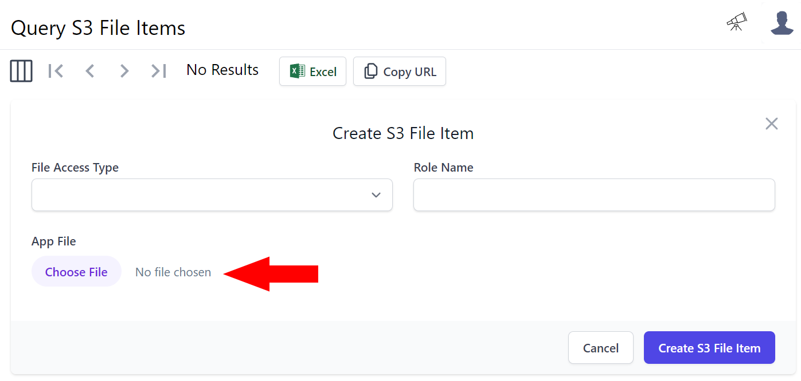

The `FileUploadFeature` plugin supports having multiple `UploadLocations` configured at once, and each UploadLocation can use a different implementation of the `IVirtualFiles` interface.

This can be added in your AppHost Configure method or IHostingStartup ConfigureAppHost method. Each UploadLocation requires a Name string and an instance of an IVirtualFiles provider.

```csharp
var s3Client = new AmazonS3Client();
var s3Vfs = new S3VirtualFiles(s3Client,"bucket-name");

Plugins.Add(new FilesUploadFeature(
  new UploadLocation("s3", s3Vfs,
      readAccessRole: RoleNames.AllowAnon,
      resolvePath: ResolveUploadPath,
      validateUpload: ValidateUpload,
      validateDownload: ValidateDownload)
));
```

In this example of integrating AWS S3, we initialize the AWS SDK AmazonS3Client, pass it to our IVirtualFiles implementation, in this case S3VirtualFiles and specify a bucket name.

To use the `S3VirtualFiles` you will need the `ServiceStack.Aws` NuGet package:

::: nuget
`<PackageReference Include="ServiceStack.Aws" Version="6.*" />`
:::

## Using File Upload Locations in APIs

With just the above configured, we can now use them in our APIs. The `[UploadTo("name")]` attribute is used with an AutoQuery request DTO and related database model class. For example, the S3FileItem table contains metadata about file access and is referenced by S3File table which contains our file metadata.

In the `FileBlazor` demo, we store the file metadata in one table which is related back to another to store additional metadata we use to limit file access.

```csharp
public class S3File
{
    [AutoIncrement]
    public int Id { get; set; }
    public string FileName { get; set; }
    
    public string FilePath { get; set; }
    public string ContentType { get; set; }
    
    public long ContentLength { get; set; }
    
    [Reference(typeof(S3FileItem))]
    public int SharedFileId { get; set; }
}

public class S3FileItem
{
    [AutoIncrement]
    public int Id { get; set; }
    public FileAccessType? FileAccessType { get; set; }
    
    [Reference]
    public S3File AppFile { get; set; }
    [References(typeof(AppUser))]
    public int AppUserId { get; set; }
    
    [Reference]
    public AppUser AppUser { get; set; }
    
    public string RoleName { get; set; }
}
```

The `S3File` data is populated automatically when a file is uploaded while creating an `S3FileItem`. We apply to `[UploadTo("s3")]` attribute to the `ICreateDb` DTO to the matching type and name for the `S3File`. The "s3" name matches the UploadLocation we previously configured in the FilesUploadFeature. This is what determines where the upload file is stored.

```csharp
public class CreateS3FileItem : ICreateDb<S3FileItem>, IReturn<S3FileItem>
{
    public FileAccessType? FileAccessType { get; set; }
    public string? RoleName { get; set; }
    
    [Input(Type = "file", UploadTo("s3")]
    public S3File AppFile { get; set; }
{
```

We also apply the `[Input(Type="file")]` attribute to enhance the Locode App so we can upload files directly from the Locode generated user interface.



## Blazor Custom Client Upload

If you need to provide a custom UI, these services accessible from multiple languages since they are HTTP services.

For example, the `FileBlazor` demo provides the ability to drag & drop files to upload. It does this using the ServiceStack JsonApiClient to MultipartFormDataContent which includes the request and the file to upload.

```csharp
async Task UploadFile(InputFileChangeEventArgs e)
{
    var request = new CreateS3FileItem
    {
        FileAccessType = FileAccessType.Private
    };
    
    using var content = new MultipartFormDataContent()
        .AddParams(request);
    
    var file = e.File;
    using var stream = file.OpenReadStream(maxFileSize);
    using var ms = new MemoryStream();
    await stream.CopyToAsync(ms);
    ms.Position = 0;
    content.AddFile("AppFile", file.Name, ms, file.ContentType);
    
    var ap = await jsonApiClient.ApiFormAsync<CreateS3FileItem>(typeof(CreateS3FileItem).ToApiUrl(), content);
    
    if(!api.Succeeded)
        errorStatus = api.Error;
}
```

