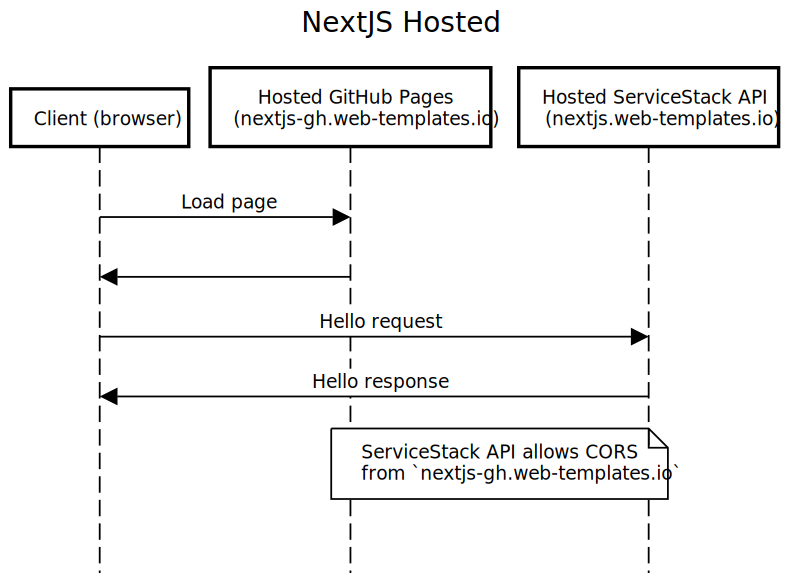
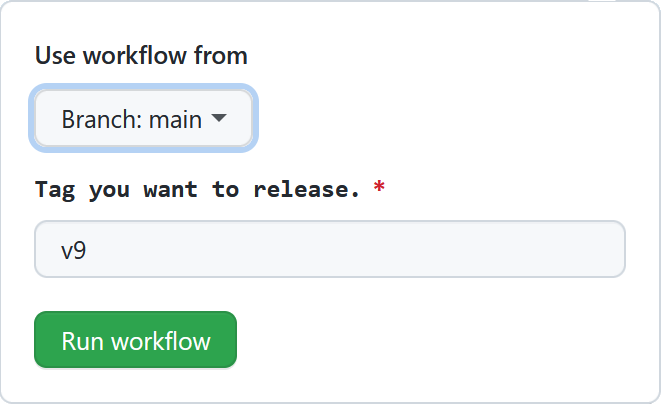

<div class="flex flex-wrap justify-center">
    
    
</div>

[NextJS](https://nextjs.org/) is a framework built on top of [React](https://reactjs.org/) that aims to solve a lot of the pain points related to rapidly developing a React application.
NextJS takes care of setting up common patterns for development, and built-in features like [routing](https://nextjs.org/docs/routing/introduction), [CSS/Sass support](https://nextjs.org/docs/basic-features/built-in-css-support), [Fast Refresh](https://nextjs.org/docs/basic-features/fast-refresh), any many more,
making it a very attractive way to build React applications.

## NextJS and JAMStack

NextJS enables the building of a static site through the use of the [`next export`](https://nextjs.org/docs/advanced-features/static-html-export) command.
This allows us to host the generated static site anywhere we like and have a clean separation between the generated static site and a well-defined webservice API provided by ServiceStack.
The [JAMStack](https://jamstack.org/) pattern promotes this separation of JavaScript, API and Markup (JAM) as the architecture of websites and applications that deliver great performance but also flexibility.
It is common to have content heavy sites, using statically generated *Markup*, that utilize modern frontend libraries and *JavaScript* combined with data from an *API* to make content compelling and interactive.

## NextJS and Edge Functions

NextJS creators, Vercel, also offer a way to host [*Edge Functions*](https://vercel.com/docs/concepts/functions/edge-functions) using JavaScript can integrate with their other hosting services.
This provides a convenient and fast way to provide custom server functionality without worrying about the hosting.

However, as convenient as they are, these don't produce [well-defined webservice APIs](why-servicestack) for easy reuse outside your web application.
This is where ServiceStack can offer a developer experience that will not only enable fast integration for your NextJS application, but for [any additional client applications in most languages and platforms](/add-servicestack-reference).

<iframe class="video-hd" src="https://www.youtube.com/embed/Vae0ALalIP0" frameborder="0" allow="autoplay; encrypted-media" allowfullscreen></iframe>

## Project Structure

Following this JAMStack pattern, the `nextjs-jam` template has a separate folder for the `ui` NextJS application, and the `api` ServiceStack application.

- `.deploy` - Files used for built-in GitHub Actions deployment.
- `.github` - GitHub Actions workflows for deployment to GitHub Pages and a Linux server with `docker compose`.
- `ui` - NextJS application used to generate your static site.
- `api` - ServiceStack application hosting your well-defined web service APIs.
- `Dockerfile` - Dockerfile for your ServiceStack application.

## UI project

The UI project is based off the NextJS [Blog Starter TypeScript](https://github.com/vercel/next.js/tree/canary/examples/blog-starter-typescript) template, providing a familiar NextJS developer workflow.
This project has support for statically generated pages from both Markdown files and TSX files.

This template has been extended with authentication coming from the ServiceStack `api` application enabled with the IdentityAuth provider and JWT. 
Admin, profile, sign-in and signup pages have been added with example integration to get you started.

This provides a pattern for content heavy Markdown in the `_posts` directory that perform well for SEO since they output static HTML pages.

Tailwind is also incorporated into this template as well, enabling you to take advantage of [Tailwind component providers](https://tailwindui.com/) that can be dropped straight into your TSX pages.

## API project

The ServiceStack application is in the root `api` directory and by default will be hosted on `http://localhost:5000` for local development.
The AppHost project has been configured with several features built-in to the template

- Auth - IdentityAuth + JWT
- AuthRepository - Custom AppUser, EntityFramework with Identity roles
- AppHost - CORS and SharpPages Plugins
- Database - EntityFramework using SQLite

## Development vs Production

During local development, the template utilizes `next.config.js` to handle rewrites from the localhost:3000 domain to our locally running ServiceStack API.


This allows us to use the ServiceStack API and the ServiceStack client to take advantage of typed end to end development, just like building any other client for a ServiceStack service.
However, we can also leverage the [`stale-while-revalidate`](https://swr.vercel.app/) library built into the NextJS framework to apply conditional fetching and local cache.

```typescript
import { client } from '../lib/gateway'
import { Hello } from '../lib/dtos'
import useSWR from 'swr';

const HelloApi = ({ name }:any) => {
  const { data, error } = useSWR(`Hello:${name}`, key => client.get(new Hello({ name })))
  if (error) return <div className="ml-2 text-red-500">{error.message}</div>
  return <div className="ml-3 text-2xl">{data ? data.result : 'loading...'}</div>
}
```

Once deployed, the hosted statically generated site will call the API at the `PROD_API` configured address. 
If you are hosting across multiple domains, you will need to configure your ServiceStack application to support CORS for the domain where you host the output from the `ui` project.

```csharp
Plugins.Add(new CorsFeature(allowOriginWhitelist:new[]{ 
    "https://localhost:5001",
    "http://localhost:5000",
    "http://localhost:3000",
    "https://nextjs-gh.web-templates.io"
}, allowCredentials:true));
```

By default, the GitHub Actions provided with the template will deploy to GitHub Pages. GitHub Pages can be configured using a `CNAME` file to use a custom domain.
The above use of the `CorsFeature` plugin in `Configure.AppHost.cs` shows we are adding the `nextjs-gh.web-templates.io` domain to the `allowOriginWhitelist` so the server will accept requests from our GitHub Pages domain of `https://nextjs-gh.web-templates.io`.



## Deployment process

JAMStack deployments are extremely flexible since the UI and API are logically separated.
They can be hosted together with the API also serving the statically generated site files, or using separate hosts with a variety of different setups.

This template utilizes [GitHub Actions](https://github.com/features/actions) to support 2 different hosting setups. Deployed together in a Docker image, hosting the static site under `wwwroot`.
Or separately on two different domains utilizing [CORS configuration](/corsfeature) to communicate across domains.
The UI project is hosted directly on [GitHub Pages](https://pages.github.com/) while the API is bundled into a Docker image and can be hosted on any [Linux server with SSH access and Docker Compose](/do-github-action-mix-deployment).

To support both, the `npm publish` command copies the statically generated site and copies the output to the `wwwroot` folder within the API before it is bundled into a docker image.
Additionally, the `release.yml` GitHub Actions workflow pushes the UI to the `gh-pages` branch of your repository to enable GitHub Pages deployment.

### Ways to deploy

By default, the template is configured to trigger a deployment on every push or Release to the GitHub repository. It can also be deployed manually providing the *tag* you want to redeploy.



This adhoc method can work with the default `latest` as well as any previous *tagged Releases* you have created.
This provides a basic rollback mechanism. If you have been uses `Releases`to tag your application, you can specify a tag, eg `v2` and the GitHub Action will do the following.

- Checkout your code at the specified tag
- Rebuild and deploy your `ui`
- Use the specified tag to change which version is running via `docker compose` on the remote server

> By default, the remote server will assume the tagged Docker image exists and does not need to be rebuilt when using a specific tag for an adhoc release.

> The provided GitHub Actions are just a starting point for how to deploy your application. When your hosting requirements change you'll need to update your GitHub Actions to suit.

## Hosting

The template provides a *starting* point for hosting your ServiceStack application using a basic Linux host with Docker + `docker compose`.
How your ServiceStack server is hosted will depend on your needs and requirements. 
For example, to avoid CORS a CDN provider could also rewrite requests to different origins which would also free up your API
to be hosted anyway you need without paying the overhead for additional CORS related requests.